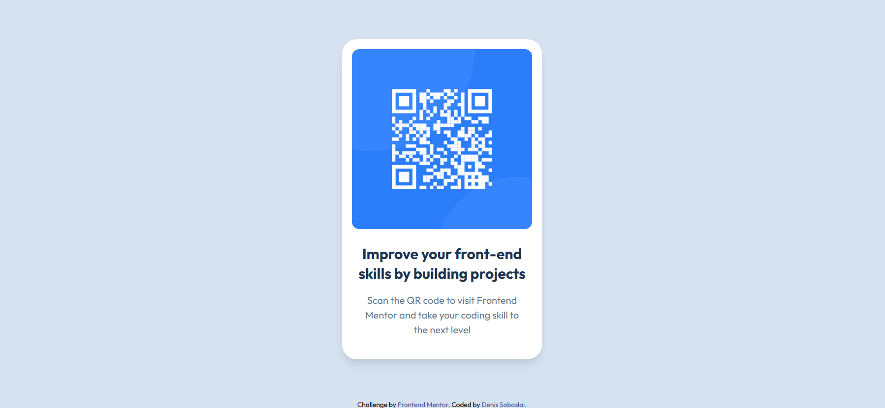

# Frontend Mentor - QR code component solution

This is a solution to the [QR code component challenge on Frontend Mentor](https://www.frontendmentor.io/challenges/qr-code-component-iux_sIO_H). Frontend Mentor challenges help you improve your coding skills by building realistic projects.

## Table of contents

- [Overview](#overview)
  - [Screenshot](#screenshot)
  - [Links](#links)
- [My process](#my-process)
  - [Built with](#built-with)
  - [What I learned](#what-i-learned)
  - [Continued development](#continued-development)
  - [Useful resources](#useful-resources)
- [Author](#author)

## Overview

### Screenshot



### Links

- Solution URL: [Add solution URL here](https://your-solution-url.com)
- Live Site URL: [Add live site URL here](https://your-live-site-url.com)

## My process

### Built with

- Semantic HTML5 markup
- Tailwind CSS
- Flexbox

### What I learned

I already have some experience working with html and css, but i wanted to try tailwind because i feel like when i design sites, the margins, paddings and some of these decisions really backfire against me. I also learned how to add custom values in tailwind. I also have started using git properly, which is a good thing.

```html
<body class="bg-[#d6e2f0] font-[Outfit]"></body>
```

### Continued development

I want to continue using tailwind, and combine it with my React knowledge to build nice, good looking and functional websites.

### Useful resources

- [Tailwind docs](https://tailwindcss.com/) - Helped me for obvious reasons, i have no experience with tailwind, and i will definitely use this a lot in the future aswell.

## Author

- Frontend Mentor - [@denissoboslai13](https://www.frontendmentor.io/profile/denissoboslai13)
